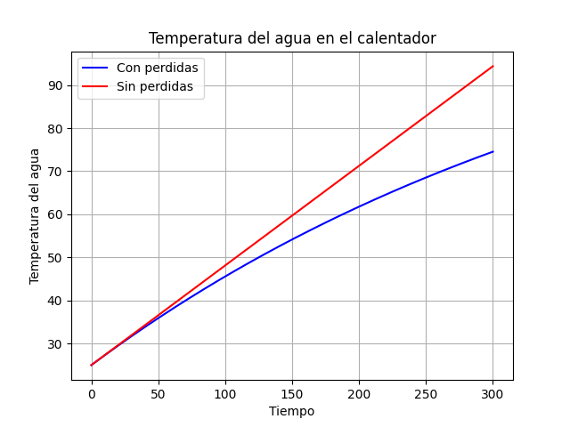

## Trabajo Práctico 4

Nuestro cuarto Trabajo Práctico, T.P. 4, 
Graficar la temperatura del fluido dentro del calentador sin pérdidas y con pérdidas para cada tick de tiempo, hasta llegar al tiempo deseado para que el dispositivo cumpla su tarea.

Para realizar el gráfico con pérdidas, se debe considerar los vatios efectivos entregados al fuido restando al calor producido por la resistencia, el calor perdido por las paredes del recipiente. Con este calor efectivo se calcula la variación de temperatura del fluido para cada tick de tiempo.

### Gráfico del cambio de temperatura a lo largo del tiempo (300 segundos)

